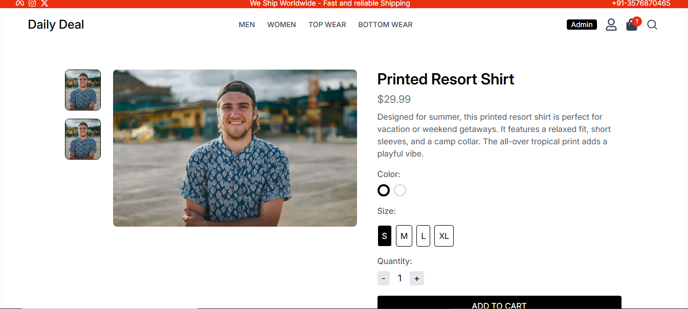
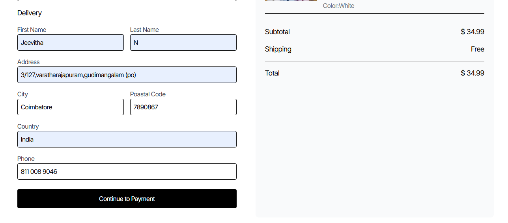
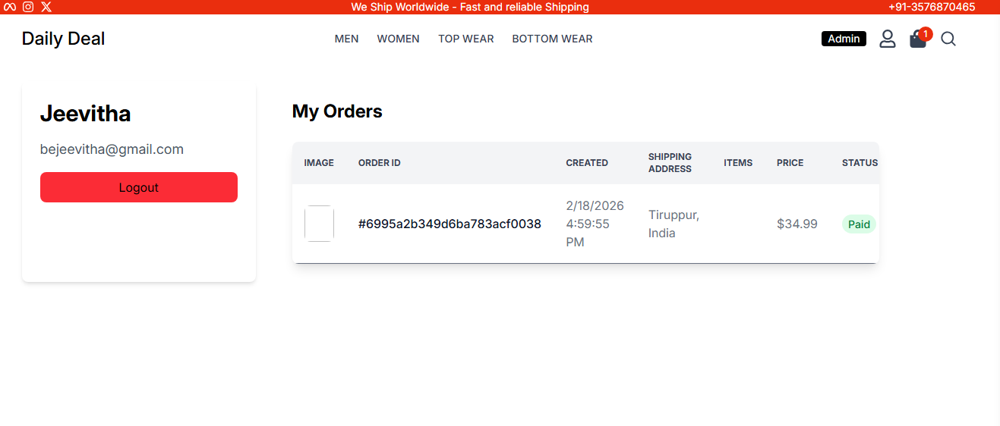
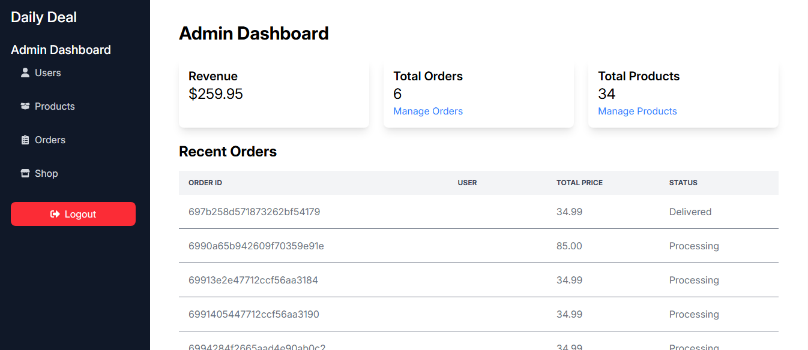

# 🚀 Daily Deal – Full Stack MERN Application

A full-stack e-commerce web application built using the MERN stack (MongoDB, Express, React, Node.js).  
Users can browse products, add to cart, place orders, and manage authentication.

---

## 🔗 Live Demo
Frontend: https://daily-deal-app-shfy.vercel.app/ 

Backend API: https://daily-deal-app.vercel.app/

---

## 📌 Features

- User Authentication (JWT)
- Product Listing & Filtering
- Add to Cart
- Order Placement
- Admin Product Management
- Responsive Design
- Payment gateway Integration
- Admin Mangament
---

## 🛠️ Tech Stack

**Frontend**
- React
- Vite
- Redux
- Axios
- React Router

**Backend**
- Node.js
- Express.js
- MongoDB
- JWT Authentication

---

## ⚙️ Installation & Setup

### 1️⃣ Clone the repository
 git clone https://github.com/Jeevitha-reactdeveloper/Daily-Deal-App.git

### 2️⃣ Install dependencies

Frontend:
- cd frontend
- npm install
- npm run dev

Backend:
- cd backend
- npm install
- npm run server

## 🔐 Environment Variables

Create a `.env` file in backend:

PORT = 

MONGO_URI = 

JWT_SECRET =

CLOUDINARY_CLOUD_NAME=

CLOUDINARY_API_KEY=

CLOUDINARY_API_SECRET=

---

## 🎯 What I Learned

- Implementing authentication using JWT
- Handling global state with Redux
- Deploying frontend & backend separately
- Managing CORS and production errors
- Payment gateway integration
- Password Hashing before storing to database
- Admin access functionality and its importance

---

## 📸 Screenshots

### 🏠 Home Page – Product Listing
Displays all available products with filtering options and responsive layout.

---

### 🔐 User Authentication – Login & Signup
Secure authentication system with JWT-based login and protected routes.

### 🛒 Shopping Cart
Users can add products to cart, update quantity, and review selected items before checkout.

---

### 📦 Order Placement
Complete order flow with user details and order confirmation.

---

### 👤 User Profile
Users can manage personal details and view their order history.

---

### 🛠️ Admin Dashboard 
Admin can add, edit, or delete products.

---

## 👩‍💻 Author

Jeevitha

LinkedIn: https://www.linkedin.com/in/jeevitha-frontenddeveloper/
